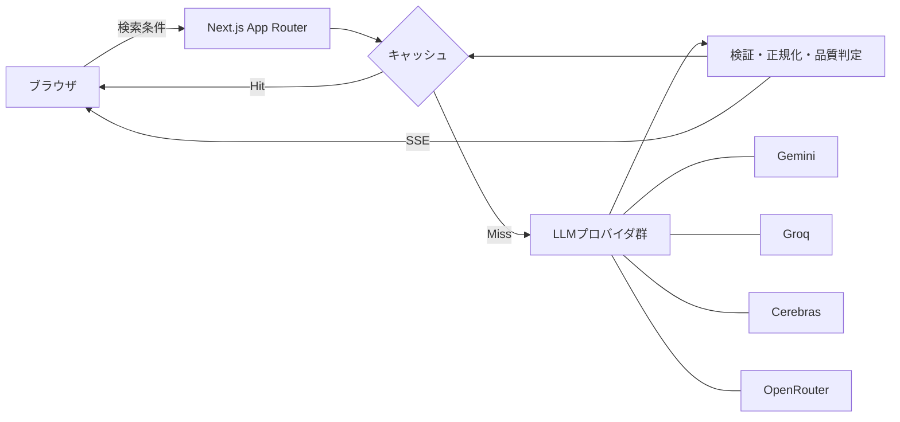

# Nuance Mapper

言葉の意味の近さだけでは捉えにくい「ニュアンスの違い」を、2つの評価軸を持つマップとして可視化するWebアプリケーションです。入力した言葉から関連表現と短い解説をLLMで生成し、それぞれの位置関係をインタラクティブに表示します。

## 主な機能

- 入力した言葉に関連する表現をLLMで生成し、2次元マップへ配置
- 「創作」「文体」「ビジネス」など6種類の評価軸プリセット
- X軸・Y軸のラベルを自由に編集できるカスタム分析
- ノードの詳細表示、コピー、パン、ズーム、全体表示
- 日本語・英語の表示切り替えとレスポンシブ対応
- Server-Sent Events（SSE）による生成結果の段階表示
- 複数のLLMプロバイダをまたぐフォールバックと品質判定
- Redisまたはローカルストレージを利用した30日間のキャッシュ
- IP単位のレート制限、入力検証、モデル出力の正規化

## システム構成



APIは設定済みのプロバイダのみを候補にし、Gemini、Groq、Cerebras、OpenRouterの順に時間差でリクエストします。利用可能なモデルは各プロバイダのモデル一覧から動的に解決するため、モデル名の変更や提供終了時にも次の候補へ切り替えられます。

## 技術スタック

| 分類 | 技術 |
| --- | --- |
| フロントエンド | Next.js 16、React 19、TypeScript 7、Tailwind CSS 4 |
| 可視化・UI | React Flow、Framer Motion、Lucide React |
| バックエンド | Next.js Route Handlers、OpenAI互換API、SSE |
| キャッシュ | Upstash Redis REST、メモリ／ローカルファイルへのフォールバック |
| テスト・品質管理 | Vitest、Testing Library、Playwright、Biome、TypeScript |
| インフラ | Docker、Terraform、さくらのクラウド AppRun／仮想サーバ、GitHub Actions |

## セットアップ

### 前提環境

- Node.js 24以上
- pnpm 11.17.0

### 起動手順

```bash
git clone https://github.com/sohohold/nuance-mapper.git
cd nuance-mapper
pnpm install
cp .env.example .env.local
pnpm dev
```

ブラウザで [http://localhost:3000](http://localhost:3000) を開きます。LLMのAPIキーを設定していない場合は、外部APIを呼び出さずモックデータを返します。

## 環境変数

すべて任意です。利用するLLMプロバイダのキーだけを設定してください。

| 環境変数 | 用途 |
| --- | --- |
| `GEMINI_API_KEY` | Google Gemini API |
| `GROQ_API_KEY` | Groq API |
| `CEREBRAS_API_KEY` | Cerebras API |
| `OPENROUTER_API_KEY` | OpenRouter API |
| `UPSTASH_REDIS_REST_URL` | Upstash Redis RESTエンドポイント |
| `UPSTASH_REDIS_REST_TOKEN` | Upstash Redis RESTトークン |

Vercel KV互換の `KV_REST_API_URL` と `KV_REST_API_TOKEN` も利用できます。Redis未設定時はプロセス内メモリとローカルファイルへフォールバックしますが、サーバーレス環境ではインスタンスをまたいだ永続性は保証されません。

APIキーやトークンは `.env.local` で管理し、リポジトリへコミットしないでください。タイムアウト、モデル候補、生成件数、キャッシュ、レート制限、マップ操作などの非機密設定は [`src/lib/config.ts`](./src/lib/config.ts) に集約しています。

## 利用できるコマンド

| コマンド | 内容 |
| --- | --- |
| `pnpm dev` | 開発サーバーを起動 |
| `pnpm build` | 本番用ビルドを生成 |
| `pnpm start` | 本番用サーバーを起動 |
| `pnpm lint` | BiomeによるLintを実行 |
| `pnpm typecheck` | TypeScriptの型検査を実行 |
| `pnpm test` | Vitestのテストを実行 |
| `pnpm test:e2e` | PlaywrightのE2Eテストを実行 |
| `pnpm check` | Biomeによる検査と自動修正を実行 |

## ディレクトリ構成

```text
src/
├── app/                     # 画面、レイアウト、生成API
├── components/              # 入力フォーム、言語切替、ニュアンスマップ
└── lib/                     # 設定、辞書、キャッシュ、検証、プロンプト
e2e/                         # Playwright E2Eテスト
terraform/
├── apprun/                  # AppRunとコンテナレジストリ
└── server/                  # Ubuntu VMとsystemd
.github/workflows/           # CI、AppRunのデプロイ／削除
```

## 設計上のポイント

### 可用性と応答速度

LLMごとの障害やクォータ超過を前提に、プロバイダを時間差で呼び出し、最初に品質条件を満たした結果を採用します。生成結果が不十分な場合は次のモデルへ切り替え、すべてのプロバイダがレート制限中であれば保存済みキャッシュを返します。

### 不定なモデル出力への対策

JSONの修復、型検証、文字数と座標の上限、重複除去、最低件数と象限分布の品質判定をAPI側で行います。品質基準に届かない結果はキャッシュせず、後続のリクエストで再生成できるようにしています。

### 操作性

デスクトップとモバイルで座標スケールやズーム範囲を切り替え、ズーム後もラベルが読めるよう表示サイズを補正しています。同一座標の語はまとめて表示し、ツールチップから個別に確認・コピーできます。

## テスト

```bash
pnpm lint
pnpm typecheck
pnpm test
pnpm test:e2e
```

ユニット／コンポーネントテストでは入力検証、辞書、プロンプト、モデル出力、キャッシュ、レート制限、UI操作を検証します。E2Eテストでは本番ビルドを起動し、主要フローとレスポンシブ表示をChromiumで確認します。GitHub Actionsでも同じ検査を継続的に実行します。

## デプロイ

Next.jsの一般的な実行環境に加え、さくらのクラウド向けに2種類のTerraform構成を用意しています。

- [さくらのクラウド構成の比較](./terraform/README.md)
- [AppRunへのコンテナデプロイ](./terraform/apprun/README.md)
- [Ubuntu仮想サーバへのデプロイ](./terraform/server/README.md)
