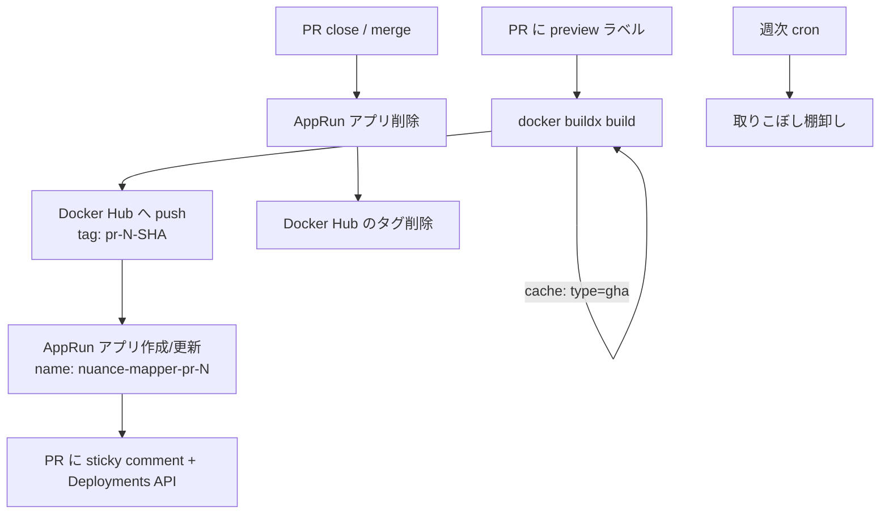

# AppRun プレビュー環境 設計メモ

GitHub の PR ごとに、さくらのクラウド AppRun（共用型）へ使い捨てのプレビュー環境を払い出す仕組みの設計。実装前の要件整理と、検証が必要な項目の一覧。

一次情報は [技術概要（AppRun）](https://manual.sakura.ad.jp/cloud/apprun/glossary.html)（2026年6月25日更新）を参照。仕様改定が速いサービスなので、実装時と執筆時にそれぞれ再確認する。

## 0. 前提の再確認で分かったこと

| 項目 | 確認結果 | 影響 |
| --- | --- | --- |
| 外部レジストリ | さくらのCRに加えて **Docker Hub / GHCR が利用可能** | 記事下書きの「将来対応」は古い。前提を書き換える |
| 公開URL | **アプリケーション単位**で自動発行。バージョン別URLは無い | プレビュー = アプリごと使い捨て、が唯一の選択肢 |
| アプリケーション数 | **最大5 / プロジェクト**（緩和申請可） | 本番1 + プレビュー4本が上限。設計の中心制約 |
| バージョン数 | 最大5 / アプリ。超過分は古い順に自動削除 | 同一PRへの再pushは自動でローテートされる。対応不要 |
| コンポーネント数 | 1 / アプリ | サイドカー不可。DBやRedisは外部（Upstash）のまま |
| トラフィック分散 | 最大4バージョン、割合(%)指定のみ | カナリアはできるがプレビュー用途には使えない |
| パケットフィルタ | 最大10 IP / アプリ | 固定IPからのアクセス制限には使えるが、CIランナーには不向き |
| イメージ | linux/amd64、2GiB以下 | Next.js standalone なら余裕 |
| リクエストタイムアウト | 1〜300秒 | 現行 `timeout_seconds = 180` は範囲内 |
| 起動タイムアウト | 4分 | コールドスタート計測の上限値として使える |
| 環境変数 | 最大50個、値は512バイトまで | 現状の6変数は問題なし |

## 1. 全体フロー



本番（`terraform/apprun`）は Terraform のまま据え置き、プレビューは state を持たない [apprun-cli](https://github.com/fujiwara/apprun-cli) で作る。PRごとに state ファイルを切って close 時に消す手間が要らず、`deploy` / `delete` / `url` の3コマンドで完結するため。

## 2. コンテナレジストリを Docker Hub へ

マニュアルの「利用可能なコンテナレジストリ」に Docker Hub が明記されているため実現可能。ただし無料プラン（Personal）の制約が効く。

- **private リポジトリは1つ、容量2GiB まで**。本番とプレビューを同一リポジトリのタグで分ける（`user/nuance-mapper:prod-<sha>` / `:pr-123-<sha>`）
- タグ間でレイヤは共有されるが、アプリ層だけでも1タグ数十MB積み上がる。**タグ削除は必須**。PR close 時に該当タグを削除し、週次で棚卸しする
- 認証付き pull は 200回 / 6時間。`min_scale = 0` のプレビューが再pullを繰り返した場合に当たる可能性があるため、レート制限の挙動は実測して記事の論点にする
- public リポジトリにすればこれらの制約は消えるが、ビルド成果物が公開される。プレビュー用途では private を維持する

**要検証（実装の最初のブロッカー）**: `deploy_source.container_registry` の `server` に Docker Hub を指定する際の正しい値。候補は `docker.io` / `index.docker.io` / `registry-1.docker.io`。`image` は `<user>/nuance-mapper:<tag>` か FQDN 付きか。private からの pull に Personal Access Token が使えるかも併せて確認する。

さくらのコンテナレジストリの月額はコスト削減の根拠になるので、料金ページから実額を控えて記事に載せる（TODO）。

## 3. buildx + registry cache の要件

結論として、**今回は `type=registry` ではなく `type=gha`（GitHub Actions Cache）を使う**。Docker Hub 無料枠の 2GiB をキャッシュイメージで食い潰すため。

キャッシュのエクスポートに必要な条件は2つ。

1. **buildx のドライバが `docker-container` であること**。素の `docker build`（`docker` ドライバ）はキャッシュの export に対応していない。`docker/setup-buildx-action` を入れれば既定で満たされる
2. **`mode=max` を指定すること**。既定の `mode=min` は最終ステージしか保存しないため、`deps` / `builder` 段が効かない

現行 Dockerfile は `package.json` / `pnpm-lock.yaml` / `pnpm-workspace.yaml` を先に COPY してから `pnpm install` しているので、レイヤキャッシュがそのまま効く。追加の書き換えは不要。

注意点:

- GHA キャッシュはリポジトリあたり10GBを共有し、**ブランチスコープ**を持つ。PRブランチは base（main）のキャッシュを読めるが、PR同士では共有されない。main への push で通常のビルドを回してキャッシュを温めておくと、各PRの初回ビルドが速くなる
- `RUN --mount=type=cache` の内容（pnpm store や `.next/cache`）は registry / gha キャッシュにエクスポートされない。Next.js のビルドキャッシュまで効かせたい場合は `actions/cache` で `.next/cache` を別途復元する必要があるが、複雑さに見合わないので初期実装では見送る
- `platforms: linux/amd64` を明示する。AppRun は amd64 のみ

## 4. Vercel のような bot は必要か

**不要。** GitHub App を作らずに Vercel 相当の PR 上の見え方を作れる。

- **Deployments API**（`permissions: deployments: write`）でデプロイを登録すると、PRのタイムラインに環境名と「View deployment」ボタンが出る。Vercel の見た目に一番近いのはこれ
- **sticky comment**（`permissions: pull-requests: write`）でURL・イメージタグ・デプロイ時刻を1つのコメントに上書き更新する。push のたびにコメントが増えない
- `github-actions[bot]` が付けたコメントは他のワークフローをトリガしないので、ループの心配はない

GitHub App が要るのは、別リポジトリへ書き込む場合、Checks API で独自チェックを出す場合、bot 名義を変えたい場合、Actions の外から操作する場合。今回はどれにも当たらない。

fork からの PR では `GITHUB_TOKEN` が read-only になりコメントできないが、後述のラベル起動方式なら自分のブランチのPRが対象なので実害はない。`pull_request_target` は任意コード実行につながるので使わない。

## 5. プレビューを非公開にする

AppRun には Vercel の Deployment Protection に相当する機能がない。**アプリ層で Basic 認証を実装する**のが現実的。**実装済み**（`src/proxy.ts`）。

- 環境変数 `PREVIEW_BASIC_AUTH_USER` / `PREVIEW_BASIC_AUTH_PASSWORD` が**両方**設定されている時だけ401を返す。本番はどちらも入れないので素通りする
- 認証を通った応答には `X-Robots-Tag: noindex, nofollow` を付ける
- パケットフィルタ（最大10 IP）は補助。GitHub Actions ランナーの egress IP は動的なので、CIからスモークテストを叩く構成とは相性が悪い

**落とし穴（対処済み）**: AppRun のヘルスチェックは `path = "/"` を叩いていた。認証が `/` に401を返すとヘルスチェックが通らず、バージョンが健全と判定されない。`/api/health` を追加して matcher から除外し、probe のパスを本番・プレビュー両方で `/api/health` に変更した。`/` はページ全体をレンダリングするため、ヘルスチェック先としてもそもそも重い。

**Next.js 16 の注意**: `middleware.ts` は非推奨になり `proxy.ts`（エクスポート名も `proxy`）へ改名された。proxy は Node.js ランタイム固定で edge を選べず、ルートセグメント設定（`export const runtime` 等）も書けない。Node ランタイムなので `node:crypto` の `timingSafeEqual` がそのまま使える。

## 6. 本番稼働中にプレビューを削除できるか

**できる。むしろ削除が必須。**

マニュアルの削除制限は「バージョン」に対するもの（トラフィック向き先・最新・唯一のバージョンは削除不可）で、**アプリケーション単位の削除には制限がない**。プレビューは本番とは別アプリなので、本番へ一切影響しない。

- PR close / merge をトリガに `apprun-cli delete`
- ワークフロー失敗による取りこぼしに備え、週次 cron で `apprun-cli list` を取り、対応するPRが閉じている `nuance-mapper-pr-*` を掃除する
- **要検証**: アプリ名は同一ユーザー内で一意。削除が非同期の場合、同じPRをreopenして同名で作り直すと衝突しうる。リトライを入れるか、タグにSHAを含めた名前にするかを実測で決める

## 7. アプリ数上限（最大5 / プロジェクト）の扱い

この制約が設計全体を決める。**本番1 + プレビュー最大4本**。

対応方針:

1. **`preview` ラベルを付けたPRだけ環境を作る**（`types: [labeled, synchronize]`）。手動オプトインにすることで自然に本数が絞られ、README にある「使いたい時だけ起動して費用を抑える」方針とも合う
2. **空きが無い場合は失敗させ、PRにコメントで通知する**。他のPRのプレビューを自動で消す実装は事故のもとなので採らない
3. 上限緩和はサポートへの申請が可能とマニュアルに明記がある。申請の可否と所要日数まで書ければ記事のオリジナリティになる
4. **要検証**: 制限のスコープが「プロジェクトごと」なので、プレビュー専用のプロジェクトを分ければ別枠の5つを確保できる可能性がある。ただしアプリ名の一意性は「同一ユーザー内」なので名前空間は跨って共有される点に注意

バージョン数（最大5/アプリ）は超過時に古い順で自動削除されるため、同一PRへの再pushでは何もしなくてよい。トラフィックは常に最新バージョンへ100%向ける（本番の `traffics` と同じ構成）。

## 8. 記事に向けた計測・記録項目

実装しながら以下を残す。後から取り直すのは高くつく。

- コールドスタート時間（`min_scale = 0` からの初回レスポンス）。イメージサイズ別に数点
- プレビュー1本あたりのデプロイ所要時間（buildキャッシュあり/なし）
- アプリ作成〜公開URLが応答するまでのラグ
- 失敗モード: ヘルスチェック不通過時の挙動、起動タイムアウト4分に当たるケース、アプリ数上限に当たった時のAPIレスポンス
- Docker Hub の pull レート制限に当たるか
- さくらのコンテナレジストリと Docker Hub の月額差

記事の軸は「単発デプロイ」ではなく、**アプリ数上限5という制約の下でプレビュー環境のライフサイクルをどう設計するか**に置く。Vercel が隠している仕事（払い出し・保護・回収・上限管理）を自分で組むと何が見えるか、という構成。

## 9. 実装順序

1. Docker Hub をデプロイソースにできるか手動で確認（`server` の値の特定）
2. ~~`/api/health` 追加 + 認証（`src/proxy.ts`）+ 本番 probe パスの変更~~ 完了
3. 本番を Docker Hub に切り替え（`terraform/apprun`）
4. `preview-sakura.yml`（ラベル起動、build → push → apprun-cli deploy → コメント/Deployments）
5. `preview-cleanup-sakura.yml`（PR closed でアプリ・タグ削除）
6. 週次棚卸し cron
7. README / 記事用の計測メモ

## 10. 検証ログ

実機で確かめた事実だけを書く。推測は「未確認」と明記する。

### 2026-08-13 Docker Hub をデプロイソースにする

捨てアプリ（`app-dfab579c-…`）に `docker.io/sauroctone/nuance-mapper:hello`（中身は Docker 公式 `hello-world`、public リポジトリ）を指定して確認した。

確認できたこと:

- **Docker Hub からの pull は成功する。** コンテナが起動し hello-world の出力がログに出た
- **`server` に指定できるのは `docker.io` だけ。** `index.docker.io` と `registry-1.docker.io` はコントロールパネル側のバリデーションで弾かれる。レジストリのホスト名を自由に書ける欄ではなく、事実上の選択肢として振る舞う
- **`image` にはレジストリのプレフィックスが必須。** `sauroctone/nuance-mapper:hello` のような Docker Hub の短縮形は通らず、`docker.io/` から書く必要がある
- private リポジトリからの pull は未確認（この検証は public で実施した）

観測した失敗モード:

- `hello-world` は標準出力に書いて即 exit するためポートを待ち受けない。結果、**ヘルスチェックが一度も通らず、バージョンの状態が「処理中」から進まない**
- コンテナは終了するたびに再起動され、同じログが数分おきに繰り返し出る（16:49 / 16:58 / 17:01）。**「起動タイムアウト4分」で失敗として打ち切られる様子はなく、処理中のまま留まり続けた**。マニュアルの記述と実挙動の差として要追記

### ヘルスチェック不通過時の挙動

実イメージ（Next.js）に差し替えて確認した。

- コンテナは正常に起動する（`▲ Next.js 16.2.10` → `✓ Ready`）が、probe に指定した `/api/health` が 404 を返すため不健全と判定され、**30〜60秒間隔で殺されて再起動される**。ログには成功した起動行だけが並び、失敗の理由はどこにも出ない。probe のパスが間違っているのか、アプリが落ちているのかをログから判別できない
- 404 の原因は、そのイメージが `/api/health` を含まないビルドだったこと。probe のパスとイメージの中身がずれると、この見分けのつかない再起動ループになる
- **状態が「処理中」でも公開URLへのリクエストはインスタンスに到達する。** 404 が返ってきたことがその証拠。hello-world で応答が無かったのは何も待ち受けていなかったからで、バージョンの状態とは無関係だった
- コントロールパネルからアプリを更新すると、**新バージョンにトラフィック100%が自動で割り当てられる**。「トラフィック0%だとインスタンスが起動しない」という懸念は、少なくともこの経路では発生しない
- バージョン名は `<アプリ名>-000NN` の連番。7回目の更新で `-00007` になっており、上限5世代のローテーションは自動で回っている

### 再起動ループの真因は probe パスの設定ミスだった

デプロイは最終的に成功し、`/api/health` は `{"status":"ok","revision":"74adbfa"}` を返した。

**原因はコントロールパネルのヘルスチェック欄が `/health` になっていたこと。** アプリが提供するのは `/api/health` なので、probe は存在しないパスを叩き続けて 404 を受け取り、AppRun がコンテナを終了させていた。

この切り分けが長引いた理由がそのまま知見になる。

- **どのパスを叩いて何が返ったのかが、ログにもUIにも一切出ない。** 見えるのは正常な起動ログの繰り返しだけで、「設定したパスが存在しない」という最も単純な原因に辿り着く手がかりが基盤側から提供されない
- 唯一の手がかりは `Component is exited: ExitCode143` というメッセージだけだった。**143 = 128 + SIGTERM(15)**、つまりアプリが自分で落ちたのではなく基盤が終了させたという情報で、アプリ側のクラッシュとの区別はここでしかつかない
- 症状（起動しては死ぬ）が、probe パスの誤り・イメージの中身の誤り・アプリのクラッシュのいずれでも同一になる。切り分けには**アプリ側に情報源を仕込むしかない**

対策として `/api/health` が `BUILD_REVISION`（コミットSHA、Dockerfile の build-arg 経由）を返すようにした。稼働中のインスタンスがどのビルドかを外から確認する手段が標準で無いため、デプロイしたSHAと突き合わせられるようにしておく。プレビューでは PR コメントに載せた SHA と一致するかで、古いイメージが動いている状況に即座に気づける。

**誤診の記録**: この症状を「同一タグ `:test` を上書き push したせいで AppRun が古い digest を掴んでいる」と診断したが、外れだった。手元のイメージには `/api/health` が入っており、AppRun 側もそれを動かしていた。ログとエラーメッセージだけでは複数の仮説を区別できないという、上に書いた問題そのものに引っかかった形になる。

### 同一タグの上書きは新バージョンを生まない（確認済み）

Docker Hub 側で `:74adbfa` を別内容（`BUILD_REVISION=overwrite-test`）で上書きしたうえで、AppRun のイメージ指定を変えずに更新を試みたところ、**「構成変更がないため新しいバージョンは作成されない」**と明示的に拒否された。

- レジストリの中身が変わっても AppRun は関知しない。バージョン作成の判定は**構成情報の文字列比較**であって、イメージの実体ではない
- 回避するには構成に差分を作る必要がある（検証では動作に影響しない環境変数を1つ追加した）。裏を返せば、**タグ運用のCIは「push したのにデプロイされない」という無言の失敗を踏む**
- CI では一意なタグ（本番はコミットSHA、プレビューは `pr-<N>-<sha>`）を使うため実運用では踏まない。イメージ参照文字列が毎回変わるので、バージョンは必ず作られる

構成差分（環境変数の追加）を作って新バージョンを作成すると、イメージ指定を `:74adbfa` のままにしていても `/api/health` は `{"status":"ok","revision":"overwrite-test"}` を返した。**新バージョン作成時にはタグを解決し直し、最新の digest を取得する。**

まとめると、AppRun のバージョン意味論はこの2行に尽きる。

> **バージョンは構成情報のスナップショットであり、イメージの digest はバージョン作成時点で解決される。**
> 構成が変わらなければバージョンは作られず、レジストリの変化は一切見に行かない。

Cloud Run が push のたびにリビジョンを作り digest に固定するのとは、どこを同一性の基準に置くかが違う。同一タグ運用でも構成差分を毎回作れば更新はできるが、無言の失敗を踏む余地が残るのでCIでは一意タグを使う。

### レイテンシ（暫定値）

再デプロイ直後、外部端末から `/api/health` を計測。

| 区分 | TTFB | total |
| --- | --- | --- |
| 1回目（TLS込み: dns 0.195 / connect 0.201 / tls 0.216） | 0.288s | 0.288s |
| 連続3回 | 0.454 / 0.488 / 0.527s | 同左 |

**この数値からコールドスタートは読み取れない。** 理由は2つ。

1. 計測前にインスタンス数が0まで落ちたことを確認していない。1回目が既にウォームだった可能性が高い（実際、後続3回の方が遅い）
2. 3回とも curl を別プロセスで実行しているため、毎回TLSハンドシェイクからやり直している。接続確立とサーバー処理時間が分離されていない

全フェーズを出して5回計測し直した結果（ウォーム状態）:

| | dns | connect | tls | ttfb | `ttfb - tls` |
| --- | --- | --- | --- | --- | --- |
| 1 | 0.454 | 0.460 | 0.473 | 0.522 | 48.7ms |
| 2 | 0.428 | 0.434 | 0.447 | 0.510 | 62.9ms |
| 3 | 0.414 | 0.420 | 0.434 | 0.483 | 48.6ms |
| 4 | 0.425 | 0.431 | 0.446 | 0.496 | 49.8ms |
| 5 | 0.427 | 0.433 | 0.446 | 0.496 | 50.1ms |

**アプリの応答は中央値50ms**（49〜63ms）。総時間0.48〜0.52秒の大半はDNS解決と接続確立で、アプリの寄与は1割程度しかない。

**注目点: DNS解決が毎回410〜455msかかっている。** TCP接続確立は `connect - dns` = 約6ms、つまりRTTは6ms程度しかないのに、名前解決だけが桁違いに遅い。curl を別プロセスで起動しているため毎回リゾルバに問い合わせが飛んでおり、キャッシュが効いていない。これが `*.ingress.apprun.sakura.ne.jp` 側の性質（TTLが極端に短い、権威サーバが遅い）なのか、計測環境のリゾルバの問題なのかは切り分けが必要。

前者ならプレビューURLを開くレビュアー全員が毎回この待ちを踏むことになり、体験の話として無視できない。切り分け方法:

```
dig +noall +answer +stats <公開URLのホスト名>          # TTLとQuery timeを見る
dig @1.1.1.1 +noall +stats <公開URLのホスト名>         # リゾルバを変えて比較
dig +noall +stats www.sakura.ad.jp                    # 同一環境の基準値
```

別途 13.56s と約13秒を観測しているが、いずれもインスタンス数0を確認していないため参考値。

コールドスタートの本測定手順:

1. `min_scale = 0` を確認し、外部からのアクセスを止める
2. メトリクスで起動中インスタンス数が0になるのを待つ。**0に落ちるまでの所要時間も記録する**（プレビューのコスト見積もりとレビュー体験に直結する）
3. `/api/health` を1回だけ叩き、全フェーズを記録
4. 直後に3〜5回叩いてウォーム値を取る
5. 2〜4を3セット以上繰り返す

### 未確認・要検証
- Terraform 経由でバージョンを追加した場合もトラフィックが自動で新バージョンへ向くのか（`traffics` を明示している現構成では表面化しないが、挙動としては確認したい）
- イメージの digest 指定（`docker.io/<user>/<repo>@sha256:…`）が受け付けられるか。通るならタグの曖昧さを構造的に排除できる
- **壊れたアプリからの復旧経路。** バージョンの削除制限（トラフィック向き先・最新・唯一のバージョンは削除不可）により、バージョンが1つしかない壊れたアプリは**バージョン単位では直せず、アプリごと削除するしかない**はず。アプリ数上限5と組み合わさると、検証中に枠を潰したまま復旧できない状況が起きうる
