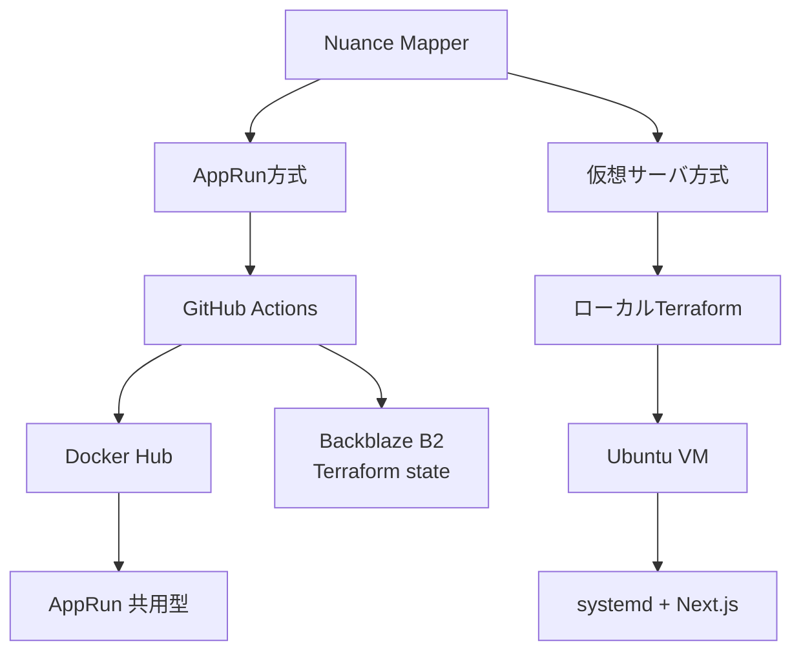

# さくらのクラウドへのデプロイ

Nuance Mapperをさくらのクラウドへ構築するTerraform構成です。コンテナをAppRunで実行する方式と、Ubuntu仮想サーバ上でsystemdサービスとして実行する方式を選択できます。

## 構成の比較

| 項目 | [`apprun/`](./apprun/) | [`server/`](./server/) |
| --- | --- | --- |
| 実行基盤 | AppRun（共用型） | Ubuntu仮想サーバ |
| アプリ配布 | Dockerイメージ | Gitリポジトリをcloneしてビルド |
| デプロイ | GitHub Actionsまたはローカル | ローカルから`terraform apply` |
| Terraform state | Backblaze B2 | ローカル |
| スケーリング | `min_scale = 0`、最大数を指定 | 常時起動、固定スペック |
| ネットワーク | AppRunの公開エンドポイント | 共有セグメント＋パケットフィルタ |
| 運用単位 | コンテナイメージとリビジョン | OS、Node.js、systemd、アプリ |
| 主な課金対象 | AppRunの使用量（イメージはDocker Hubの無料枠） | サーバ、ディスクなどの常設リソース |

アクセスが断続的で、コンテナとCI/CDを中心に運用する場合は`apprun/`が適しています。OSレベルの設定、SSHによる調査、systemdでのプロセス管理が必要な場合は`server/`を選択します。

## 全体像



## ディレクトリ構成

```text
terraform/
├── apprun/                 # AppRun、リモートstate（イメージはDocker Hub）
│   ├── main.tf
│   ├── variables.tf
│   ├── outputs.tf
│   └── backend.hcl.example
└── server/                 # VM、ディスク、パケットフィルタ、起動スクリプト
    ├── main.tf
    ├── variables.tf
    ├── outputs.tf
    └── startup.sh.tftpl
```

## 共通の前提

- さくらのクラウドのアカウントとAPIキー
- Terraform 1.11以上
- `sacloud/sakura`プロバイダ 3.12系
- デプロイ先で使用するLLM APIキー（任意）

認証情報は`.tf`ファイルや変数の既定値へ書かず、環境変数またはGitHub Secretsから渡します。

## 運用上の注意

- `terraform apply`で有料リソースが作成されると課金が始まります。最新の単価は[さくらのクラウド料金シミュレーション](https://cloud.sakura.ad.jp/payment/simulation/)で確認してください。
- 利用を終えたリソースは、各READMEの手順に従って`terraform destroy`を実行します。
- Terraform管理下のリソースをコントロールパネルから直接削除すると、stateと実環境に差異が生じます。作成・更新・削除は原則としてTerraform経由で行ってください。
- `terraform.tfstate`やバックエンド設定には機密情報が含まれる可能性があります。コミットせず、アクセス権を制限してください。
- AppRun方式と仮想サーバ方式は別々のstateで管理されます。同じリソース名を使う場合も、意図せず両方を起動しないよう注意してください。

具体的な手順は、[AppRun方式](./apprun/README.md)または[仮想サーバ方式](./server/README.md)を参照してください。
