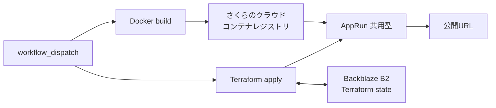

# AppRunへのコンテナデプロイ

Nuance MapperをDockerイメージとしてビルドし、さくらのクラウドのコンテナレジストリとAppRun（共用型）へデプロイする構成です。GitHub Actionsから、イメージのビルド、push、Terraformによる更新までを一連の処理として実行できます。

## 構成



## 特徴

- GitHub Actionsの手動実行によるデプロイ
- コミットSHAまたは指定値を使ったイメージタグ管理
- `min_scale = 0`によるアイドル時のスケールゼロ
- Backblaze B2のS3互換APIでのTerraform state共有
- デプロイと削除の同時実行を防ぐconcurrency設定
- 確認文字列を要求する削除ワークフロー
- LLM APIキーとRedis認証情報の環境変数注入

## 作成されるリソース

| リソース | 内容 |
| --- | --- |
| `sakura_container_registry` | Dockerイメージを保存するコンテナレジストリ |
| `sakura_apprun_shared` | Next.jsコンテナを実行するAppRunアプリ |

Terraform state用のオブジェクトストレージバケットは、この構成の管理対象外です。初回のみ手動で作成します。

## 前提

- さくらのクラウドのアカウントとAPIキー
- Backblaze B2
- GitHub Actionsを利用できるリポジトリ
- Terraform 1.11以上、Docker（ローカル実行時）

## 初回設定

### 1. state保存用バケットを作成する

1. Backblazeの管理画面でB2 Cloud Storageを有効にします。
2. 世界で一意になる名前を指定し、非公開（Private）のバケットを作成します。
3. バケットに表示されるS3 Endpointからregion（例: `us-west-004`）を控えます。
4. Application Keysから、このバケットだけにアクセスできるRead and WriteのApplication Keyを作成します。
5. 表示された`keyID`と`applicationKey`を控えます。`applicationKey`は作成時にしか表示されません。

stateを誤って上書きした場合に復旧できるよう、古いファイルバージョンを30～90日残すLifecycle Ruleの設定を推奨します。

バックエンドが自身を保存するバケットを同じTerraform構成で作ることはできないため、この作業だけはTerraform実行前に必要です。

### 2. レジストリ名を決定する

`registry_subdomain_label`には、さくらのクラウド全体で一意の値が必要です。作成されるFQDNは次の形式です。

```text
<registry_subdomain_label>.sakuracr.jp
```

### 3. GitHub Secretsを登録する

リポジトリの「Settings」→「Secrets and variables」→「Actions」で次の値を登録します。

| Secret | 用途 | 必須 |
| --- | --- | :---: |
| `SAKURA_ACCESS_TOKEN` | さくらのクラウドAPIのアクセストークン | ✓ |
| `SAKURA_ACCESS_TOKEN_SECRET` | さくらのクラウドAPIのシークレット | ✓ |
| `B2_APPLICATION_KEY_ID` | B2 Application Key ID（`keyID`） | ✓ |
| `B2_APPLICATION_KEY` | B2 Application Key（`applicationKey`） | ✓ |
| `B2_TFSTATE_BUCKET` | B2のstateバケット名 | ✓ |
| `B2_REGION` | B2のregion（例: `us-west-004`） | ✓ |
| `SAKURA_REGISTRY_SUBDOMAIN_LABEL` | レジストリのサブドメインラベル | ✓ |
| `SAKURA_REGISTRY_USERNAME` | レジストリのログインユーザー名 | ✓ |
| `SAKURA_REGISTRY_PASSWORD` | レジストリのログインパスワード | ✓ |
| `GEMINI_API_KEY` | Gemini APIキー | 任意 |
| `GROQ_API_KEY` | Groq APIキー | 任意 |
| `CEREBRAS_API_KEY` | Cerebras APIキー | 任意 |
| `OPENROUTER_API_KEY` | OpenRouter APIキー | 任意 |
| `UPSTASH_REDIS_REST_URL` | Redis RESTエンドポイント | 任意 |
| `UPSTASH_REDIS_REST_TOKEN` | Redis RESTトークン | 任意 |

## GitHub Actionsからデプロイする

1. GitHubの「Actions」タブを開きます。
2. `Deploy to Sakura AppRun`を選択します。
3. `Run workflow`を実行します。必要に応じてイメージタグを入力します。
4. 完了後、Job Summaryに出力されたアプリURLへアクセスします。

初回はコンテナレジストリだけを先に作成してからイメージをpushし、続く`terraform apply`でAppRunを作成します。2回目以降は新しいタグのイメージを使うリビジョンへ更新されます。`main`ブランチへのpushでは自動デプロイされません。

## ローカルからデプロイする

### 1. 設定ファイルを準備する

```bash
cd terraform/apprun
cp backend.hcl.example backend.hcl
cp terraform.tfvars.example terraform.tfvars
```

`backend.hcl`にstateバケットの情報を、`terraform.tfvars`にレジストリ名などを設定します。どちらもGitへコミットしないでください。

### 2. 認証情報を設定する

```bash
export SAKURA_ACCESS_TOKEN="..."
export SAKURA_ACCESS_TOKEN_SECRET="..."
export AWS_ACCESS_KEY_ID="B2 Application Key ID"
export AWS_SECRET_ACCESS_KEY="B2 Application Key"
```

### 3. レジストリを作成する

```bash
terraform init -backend-config=backend.hcl
terraform plan -target=sakura_container_registry.main
terraform apply -target=sakura_container_registry.main
```

### 4. イメージをpushする

リポジトリのルートをビルドコンテキストとして指定します。

```bash
docker login <registry_subdomain_label>.sakuracr.jp -u <username>
docker build -t <registry_subdomain_label>.sakuracr.jp/nuance-mapper:local ../..
docker push <registry_subdomain_label>.sakuracr.jp/nuance-mapper:local
```

### 5. AppRunを作成する

```bash
terraform plan -var="image_tag=local"
terraform apply -var="image_tag=local"
terraform output -raw app_url
```

## パスワードのローテーション

レジストリのパスワードは`password_wo`属性で渡すため、値そのものはTerraform stateに保存されません。一方、Terraformは値を読み戻せないため、パスワード変更時は`registry_password_version`も増やす必要があります。

```bash
terraform apply \
  -var="registry_password=新しいパスワード" \
  -var="registry_password_version=2"
```

GitHub Actionsでは`SAKURA_REGISTRY_PASSWORD`を更新したうえで、[`variables.tf`](./variables.tf)の`registry_password_version`を増やすか、ワークフローから対応する変数を渡してください。

## リソースを削除する

### GitHub Actions

1. 「Actions」タブで`Destroy Sakura AppRun`を選択します。
2. `Run workflow`を開き、確認欄へ`destroy`と入力します。
3. ワークフローを実行します。

### ローカル

```bash
terraform plan -destroy
terraform destroy
```

AppRunアプリとコンテナレジストリが削除されます。stateバケットはTerraformの管理外なので残ります。不要になった場合は、stateが不要であることを確認してから個別に削除してください。

## セキュリティとstate管理

- レジストリの`password_wo`はwrite-onlyですが、AppRunの`env`へ渡すLLM APIキーなどはTerraform stateに保存されます。stateバケットの公開を避け、アクセス権を最小限にしてください。
- `backend.hcl`、`terraform.tfvars`、認証情報をリポジトリへコミットしないでください。
- コントロールパネルや`usacloud`からTerraform管理リソースを直接削除しないでください。
- GitHub Actionsのデプロイと削除は同一のconcurrency groupで直列化されています。別経路でTerraformを実行する場合も同じstateへの同時操作を避けてください。
- B2のS3互換APIではTerraformが条件付きPUTで作成するlockfileの動作を保証できないため、`use_lockfile`は有効にしていません。

## コスト管理

AppRunは`min_scale = 0`のため、アクセスがない間は実行インスタンスをゼロにできます。B2は無料利用枠を超えた保存容量、API呼び出し、転送量などが課金対象になる可能性があります。コンテナレジストリなど、さくら側の課金対象も残ります。利用前に[Backblaze B2 Pricing](https://www.backblaze.com/cloud-storage/pricing)と[さくらのクラウド料金シミュレーション](https://cloud.sakura.ad.jp/payment/simulation/)で最新の単価を確認してください。
