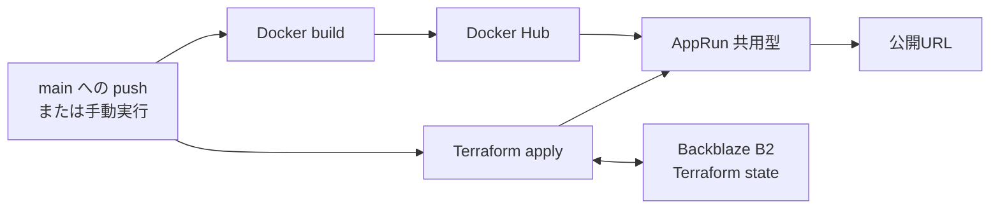

# AppRunへのコンテナデプロイ

Nuance MapperをDockerイメージとしてビルドし、Docker Hubとさくらのクラウドのアプリケーション実行基盤AppRun（共用型）へデプロイする構成です。GitHub Actionsから、イメージのビルド、push、Terraformによる更新までを一連の処理として実行できます。

## 構成



## 特徴

- `main`へのpush（PRのmerge）で自動デプロイ。手動実行でのタグ指定・切り戻しも可能
- コミットSHAまたは指定値を使ったイメージタグ管理
- コンテナレジストリはDocker Hub（さくらのコンテナレジストリの月額が不要）
- `min_scale = 0`によるアイドル時のスケールゼロ
- Backblaze B2のS3互換APIでのTerraform state共有
- デプロイと削除の同時実行を防ぐconcurrency設定
- 確認文字列を要求する削除ワークフロー
- LLM APIキーとRedis認証情報の環境変数注入
- `/api/health`が返す`revision`で、稼働中のインスタンスがどのビルドかを確認できる

## 作成されるリソース

| リソース | 内容 |
| --- | --- |
| `sakura_apprun_shared` | Next.jsコンテナを実行するAppRunアプリ |

コンテナイメージの保管先はDocker Hubで、Terraformの管理対象外です。Terraform state用のオブジェクトストレージバケットも管理対象外で、初回のみ手動で作成します。

## 前提

- さくらのクラウドのアカウントとAPIキー
- Docker Hubのアカウント
- Backblaze B2
- GitHub Actionsを利用できるリポジトリ
- Terraform 1.11以上、Docker（ローカル実行時）

## イメージタグに関する重要な注意

**タグは必ず一意にしてください（コミットSHAを推奨）。**

AppRunのバージョンは構成情報のスナップショットであり、イメージのdigestはバージョン作成時点で解決されます。イメージ参照文字列が変わらなければ、Docker Hub側で同じタグを別のイメージに上書きしても新しいバージョンは作成されません。**`docker push`は成功するのに何もデプロイされない**という無言の失敗になります。

digest指定（`image_tag = "sha256:..."`）も使えます。イメージが変われば参照文字列も必ず変わるため、この失敗が原理的に起きません。

## 初回設定

### 1. state保存用バケットを作成する

1. Backblazeの管理画面でB2 Cloud Storageを有効にします。
2. 世界で一意になる名前を指定し、非公開（Private）のバケットを作成します。
3. バケットに表示されるS3 Endpointからregion（例: `us-west-004`）を控えます。
4. Application Keysから、このバケットだけにアクセスできるRead and WriteのApplication Keyを作成します。
5. 表示された`keyID`と`applicationKey`を控えます。`applicationKey`は作成時にしか表示されません。

stateを誤って上書きした場合に復旧できるよう、古いファイルバージョンを30～90日残すLifecycle Ruleの設定を推奨します。

バックエンドが自身を保存するバケットを同じTerraform構成で作ることはできないため、この作業だけはTerraform実行前に必要です。

### 2. Docker Hubを準備する

1. Docker Hubで`nuance-mapper`リポジトリを作成します。
2. Account Settings → Personal access tokensでトークンを発行します。pushする側（GitHub Actions）にはRead & Write、AppRunがpullするだけならReadで足ります。ここでは同じトークンを両方に使う前提です。

無料のPersonalプランでは、privateリポジトリは1つ・2GiBまでです。本番のSHAタグはデプロイのたびに増えるため、デプロイワークフローの最後で新しい順に10件だけ残して自動削除します（保持数は`KEEP_TAGS`）。プレビュー用の`pr-`で始まるタグはプレビュー側のワークフローが管理するので対象外です。

イメージの参照は`docker.io/<ユーザー名>/nuance-mapper:<タグ>`の形式です。プレフィックスの省略はできません。

**認証に使うホスト名（`server`）はイメージ参照のプレフィックスとは別物で、Docker Hubでは`index.docker.io`です。** コントロールパネルの入力欄は`docker.io`しか受け付けませんが、保存される値は`index.docker.io`で、APIに`docker.io`を送ると400 Validation Errorになります。`image_registry_host`（`docker.io`）と`image_registry_server`（`index.docker.io`）を分けているのはこのためです。

### 3. GitHub Secretsを登録する

リポジトリの「Settings」→「Secrets and variables」→「Actions」で次の値を登録します。

| Secret | 用途 | 必須 |
| --- | --- | :---: |
| `SAKURA_ACCESS_TOKEN` | さくらのクラウドAPIのアクセストークン | ✓ |
| `SAKURA_ACCESS_TOKEN_SECRET` | さくらのクラウドAPIのシークレット | ✓ |
| `B2_APPLICATION_KEY_ID` | B2 Application Key ID（`keyID`） | ✓ |
| `B2_APPLICATION_KEY` | B2 Application Key（`applicationKey`） | ✓ |
| `B2_TFSTATE_BUCKET` | B2のstateバケット名 | ✓ |
| `B2_REGION` | B2のregion（例: `us-west-004`） | ✓ |
| `DOCKERHUB_USERNAME` | Docker Hubのユーザー名。イメージの名前空間にも使う | ✓ |
| `DOCKERHUB_TOKEN` | Docker HubのPersonal Access Token | ✓ |
| `GEMINI_API_KEY` | Gemini APIキー | 任意 |
| `GROQ_API_KEY` | Groq APIキー | 任意 |
| `CEREBRAS_API_KEY` | Cerebras APIキー | 任意 |
| `OPENROUTER_API_KEY` | OpenRouter APIキー | 任意 |
| `UPSTASH_REDIS_REST_URL` | Redis RESTエンドポイント | 任意 |
| `UPSTASH_REDIS_REST_TOKEN` | Redis RESTトークン | 任意 |

Docker Hubの組織アカウントを使う場合は、名前空間がユーザー名と異なります。ワークフローの`TF_VAR_image_namespace`と`IMAGE`の組み立てを組織名に変更してください。

## GitHub Actionsからデプロイする

`main`ブランチへのpush（PRのmergeを含む）で`Deploy to Sakura AppRun`が自動実行されます。イメージタグにはコミットSHAが使われます。

以前のイメージへ切り戻す場合は手動で起動します。

1. GitHubの「Actions」タブを開きます。
2. `Deploy to Sakura AppRun`を選択します。
3. `Run workflow`を開き、戻したいイメージのタグを入力して実行します。
4. 完了後、Job Summaryに出力されたアプリURLへアクセスします。

**タグを指定するとビルドを行わず、Docker Hub上の既存イメージをそのまま配ります。** ビルドしてしまうと、チェックアウト中のソースを指定したタグへ上書きすることになり、戻したいイメージが失われるためです。タグを空欄にした場合のみ、コミットSHAをタグとしてビルドとpushを行います。

デプロイと削除は同じconcurrency groupで直列化されているため、連続してmergeした場合は順番に処理されます。

デプロイ後、稼働中のビルドは次のように確認できます。

```bash
curl -sS "$(terraform output -raw app_url)/api/health"
# => {"status":"ok","revision":"<コミットSHA>"}
```

`revision`がデプロイしたタグと一致しない場合、古いイメージが動いています。

## ローカルからデプロイする

### 1. 設定ファイルを準備する

```bash
cd terraform/apprun
cp backend.hcl.example backend.hcl
cp terraform.tfvars.example terraform.tfvars
```

`backend.hcl`にstateバケットの情報を、`terraform.tfvars`にDocker Hubの情報を設定します。どちらもGitへコミットしないでください。

### 2. 認証情報を設定する

```bash
export SAKURA_ACCESS_TOKEN="..."
export SAKURA_ACCESS_TOKEN_SECRET="..."
export AWS_ACCESS_KEY_ID="B2 Application Key ID"
export AWS_SECRET_ACCESS_KEY="B2 Application Key"
```

### 3. イメージをpushする

リポジトリのルートをビルドコンテキストとして指定します。`BUILD_REVISION`は`/api/health`が返す識別子で、タグと同じ値を渡します。

```bash
TAG=$(git rev-parse --short HEAD)
docker login -u <ユーザー名>
docker build --platform linux/amd64 --build-arg "BUILD_REVISION=$TAG" \
  -t "docker.io/<ユーザー名>/nuance-mapper:$TAG" ../..
docker push "docker.io/<ユーザー名>/nuance-mapper:$TAG"
```

AppRunが受け付けるアーキテクチャは`linux/amd64`のみ、イメージサイズの上限は2GiBです。

### 4. AppRunを作成・更新する

```bash
terraform init -backend-config=backend.hcl
terraform plan -var="image_tag=$TAG"
terraform apply -var="image_tag=$TAG"
terraform output -raw app_url
```

## トークンのローテーション

レジストリのトークンは`password_wo`属性で渡すため、値そのものはTerraform stateに保存されません。一方、Terraformは値を読み戻せないため、**変更時は`registry_password_version`を現在の値より大きくする**必要があります。同じ番号のまま新しいトークンを渡しても、Terraformは「変更なし」と判断して送信しません。

現在の値は[`variables.tf`](./variables.tf)のデフォルトで、**2**です。次にローテーションするときは3を指定します。

```bash
terraform apply \
  -var="registry_password=新しいトークン" \
  -var="registry_password_version=3"
```

GitHub Actionsでは`DOCKERHUB_TOKEN`を更新したうえで、[`variables.tf`](./variables.tf)のデフォルト値を増やしてください（ワークフローはこの変数を渡していないため、デフォルトがそのまま使われます）。

**レジストリそのものを差し替える場合も、認証情報が変わるのでこの番号を増やす必要があります。** さくらのコンテナレジストリからDocker Hubへ移行した際にこれを怠り、serverとusernameだけが新しくなってパスワードが旧レジストリのまま更新され、APIが400を返して本番が停止しかけました。

## リソースを削除する

### GitHub Actions

1. 「Actions」タブで`Destroy Sakura AppRun`を選択します。
2. `Run workflow`を開き、確認欄へ`destroy`と入力します。
3. ワークフローを実行します。

### ローカル

本番アプリには`prevent_destroy`を設定しているため、まず[`main.tf`](./main.tf)の`lifecycle`ブロックを削除してください。

```bash
terraform plan -destroy
terraform destroy
```

AppRunアプリが削除されます。Docker Hub上のイメージとstateバケットはTerraformの管理外なので残ります。不要になった場合は個別に削除してください。

## さくらのコンテナレジストリからの移行

以前はイメージの保管にさくらのコンテナレジストリ（`sakura_container_registry`）を使っていました。この構成からはリソースごと削除されているため、**そのまま`terraform apply`を実行すると既存のレジストリとその中のイメージが破棄されます。**

レジストリを残したい場合は、apply前にTerraformの管理から外してください。

```bash
terraform state rm sakura_container_registry.main
```

これでリソースはstateから消えますが、さくら側には残ります。以後はコントロールパネルから手動で管理・削除することになります。

## 本番アプリの置換について

`sakura_apprun_shared.main`には`prevent_destroy`を設定してあります。置換（削除して再作成）は**公開URLが変わる**うえ、`main`へのmergeで無人のapplyが走る構成では、置換が必要になったことに誰も気付けないまま本番が消えます。

実際にこれが起きました。コントロールパネルからイメージを差し替えた際にコンポーネント名が`nuance-mapper:<タグ>`に書き換わり、それを差分と見たTerraformがアプリを破棄しました。`prevent_destroy`があれば、applyはplanの段階でエラーになって止まります。

**コントロールパネルからの編集は、Terraformが管理する属性を書き換えて置換を誘発します。** 緊急時以外は使わず、使った場合は次のapplyのplanを必ず目視してください。

## セキュリティとstate管理

- レジストリの`password_wo`はwrite-onlyですが、AppRunの`env`へ渡すLLM APIキーなどはTerraform stateに保存されます。stateバケットの公開を避け、アクセス権を最小限にしてください。
- `backend.hcl`、`terraform.tfvars`、認証情報をリポジトリへコミットしないでください。
- コントロールパネルや`usacloud`からTerraform管理リソースを直接削除しないでください。
- GitHub Actionsのデプロイと削除は同一のconcurrency groupで直列化されています。別経路でTerraformを実行する場合も同じstateへの同時操作を避けてください。
- B2のS3互換APIではTerraformが条件付きPUTで作成するlockfileの動作を保証できないため、`use_lockfile`は有効にしていません。

## コスト管理

AppRunは`min_scale = 0`のため、アクセスがない間は実行インスタンスをゼロにできます。ただしスケールゼロからの復帰には基盤側で9秒前後かかることを観測しています。

Docker Hubへ移行したことで、さくらのコンテナレジストリの料金は発生しません。代わりに無料プランの制約（privateは1リポジトリ・2GiB、認証済みpullは200回/6時間）が上限になります。本番タグは直近10件に自動で整理されるため、放置してもこの枠を使い切ることはありません。切り戻せる範囲もこの10件です。

B2は無料利用枠を超えた保存容量、API呼び出し、転送量などが課金対象になる可能性があります。利用前に[Backblaze B2 Pricing](https://www.backblaze.com/cloud-storage/pricing)と[さくらのクラウド料金シミュレーション](https://cloud.sakura.ad.jp/payment/simulation/)で最新の単価を確認してください。
