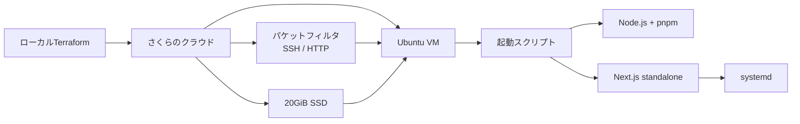

# Ubuntu仮想サーバへのデプロイ

[`sacloud/sakura`](https://registry.terraform.io/providers/sacloud/sakura/latest)プロバイダを使い、Nuance MapperをさくらのクラウドのUbuntu仮想サーバへ構築するTerraform構成です。初回起動時にNode.jsの導入、アプリのビルド、systemdサービスの登録までを自動実行します。

## 構成



## 作成されるリソース

| リソース | 内容 |
| --- | --- |
| `sakura_server` | 既定で2コア／4GiB、共有セグメント接続の仮想サーバ |
| `sakura_disk` | Ubuntuの最新公開アーカイブから作成する20GiB SSD |
| `sakura_packet_filter` / `_rules` | SSH（22）、HTTP（80）、必要な戻り通信だけを許可 |
| `sakura_script` | Node.js導入、clone、ビルド、systemd登録を行う起動スクリプト |

CPU、メモリ、ディスク容量、ゾーンなどは[`terraform.tfvars.example`](./terraform.tfvars.example)を基に変更できます。

## 前提

- さくらのクラウドのアカウントとAPIキー
- Terraform 1.11以上
- SSH鍵ペア
- サーバーからcloneできる公開Gitリポジトリ

SSH鍵がない場合は、次のように作成できます。

```bash
ssh-keygen -t ed25519
```

## デプロイ手順

### 1. API認証情報を設定する

さくらのクラウドのコントロールパネルでAPIキーを発行し、現在のシェルへ設定します。

```bash
export SAKURA_ACCESS_TOKEN="発行したアクセストークン"
export SAKURA_ACCESS_TOKEN_SECRET="発行したシークレット"
```

Terraformが環境変数を読み取るため、認証情報を`.tf`ファイルへ記述する必要はありません。

### 2. 変数ファイルを準備する

```bash
cd terraform/server
cp terraform.tfvars.example terraform.tfvars
```

`terraform.tfvars`を編集し、少なくとも`ssh_public_key`へSSH公開鍵の内容を設定します。必要に応じてゾーン、サーバースペック、リポジトリURL、ブランチも変更してください。

```hcl
ssh_public_key = "ssh-ed25519 AAAA..."
```

LLM APIキーは起動スクリプトやTerraform変数へ含めないでください。`sakura_script`の内容とTerraform stateに平文で保存されるため、デプロイ後にサーバー上で設定します。

### 3. 内容を確認して作成する

```bash
terraform init
terraform fmt -check
terraform validate
terraform plan
terraform apply
```

完了すると、アプリURL、IPアドレス、SSHコマンドが出力されます。

```text
app_url     = "http://203.0.113.10/"
ip_address  = "203.0.113.10"
ssh_command = "ssh ubuntu@203.0.113.10"
```

サーバー作成後も起動スクリプトによる依存関係の導入とビルドが続きます。アプリが応答するまで数分かかる場合があります。

## 動作確認

```bash
ssh ubuntu@<ip_address>
```

```bash
# 初回セットアップの進行状況
sudo tail -f /var/log/nuance-mapper-setup.log

# サービスの状態
sudo systemctl status nuance-mapper

# アプリケーションログ
sudo journalctl -u nuance-mapper -f
```

## LLM APIキーを設定する

APIキーを設定しなくてもモックデータで動作します。実際のLLMを利用する場合は、SSH接続後に専用ユーザーの`.env.local`へ追記します。

```bash
sudo -u app vi /opt/nuance-mapper/.env.local
sudo systemctl restart nuance-mapper
```

設定例:

```dotenv
GEMINI_API_KEY=...
UPSTASH_REDIS_REST_URL=...
UPSTASH_REDIS_REST_TOKEN=...
```

`.env.local`は起動スクリプトによって所有者`app`、パーミッション`600`で作成されます。

## アプリを更新する

```bash
ssh ubuntu@<ip_address>
cd /opt/nuance-mapper
sudo -u app -H git pull
sudo -u app -H pnpm install --frozen-lockfile
sudo -u app -H pnpm build
sudo -u app -H cp -r public .next/standalone/public
sudo -u app -H cp -r .next/static .next/standalone/.next/static
sudo systemctl restart nuance-mapper
```

`pnpm build`は`.next/standalone`を作り直すため、`public`と`.next/static`も毎回コピーします。

## インフラ構成を変更する

`terraform.tfvars`を編集した後、差分を確認して適用します。

```bash
terraform plan
terraform apply
```

スペックやディスクなど、変更内容によってはリソースの再作成が発生します。`terraform plan`の`forces replacement`表示を確認してから適用してください。

## リソースを削除する

```bash
terraform plan -destroy
terraform destroy
```

削除後はサーバーへ保存した`.env.local`やログも失われます。必要な情報を退避してから実行してください。課金対象と最新単価は[料金シミュレーション](https://cloud.sakura.ad.jp/payment/simulation/)で確認できます。

## セキュリティ上の考慮事項

- SSHは公開鍵認証のみで、パスワード認証は無効です。
- パケットフィルタはSSH（22）とHTTP（80）を公開し、それ以外の受信通信を拒否します。
- 起動スクリプトとTerraform stateへAPIキーやアクセストークンを含めないでください。
- `terraform.tfvars`と`terraform.tfstate`をリポジトリへコミットしないでください。
- 現在の構成はHTTPのみです。外部公開時は独自ドメイン、TLS終端、443番ポートの許可を追加してください。

## トラブルシューティング

### `401`などの認証エラー

APIキーの環境変数が、Terraformを実行しているシェルに設定されているか確認します。値そのものを画面共有やログへ出さないよう注意してください。

```bash
test -n "$SAKURA_ACCESS_TOKEN" && echo "token is set"
test -n "$SAKURA_ACCESS_TOKEN_SECRET" && echo "secret is set"
```

### 初回セットアップが完了しない

`/var/log/nuance-mapper-setup.log`を確認します。clone、パッケージ取得、ビルドのいずれで停止したかを特定した後、必要に応じてコマンドを手動で再実行します。

### プライベートリポジトリを使う

トークン付きURLを`repo_url`へ設定しないでください。起動スクリプトとstateに認証情報が残ります。デプロイ後にSSH接続し、専用のデプロイ鍵などを設定したうえで手動cloneしてください。

### HTTPSを有効にする

Next.jsを3000番ポートで待ち受けさせ、Caddyなどのリバースプロキシで80／443番から転送します。合わせてパケットフィルタで443番を許可し、systemdユニットを更新してください。
